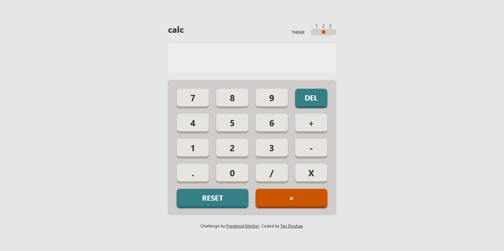

# Frontend Mentor - Calculator app solution

This is a solution to the [Calculator app challenge on Frontend Mentor](https://www.frontendmentor.io/challenges/calculator-app-9lteq5N29). Frontend Mentor challenges help you improve your coding skills by building realistic projects. 

## Table of contents

  - [The challenge](#the-challenge)
  - [Screenshot](#screenshot)
  - [Links](#links)
  - [Built with](#built-with)
  - [What I learned](#what-i-learned)
- [Author](#author)

### The challenge

Users should be able to:

- See the size of the elements adjust based on their device's screen size
- Perform mathmatical operations like addition, subtraction, multiplication, and division
- Adjust the color theme based on their preference
- **Bonus**: Have their initial theme preference checked using `prefers-color-scheme` and have any additional changes saved in the browser

### Screenshot

### Links

- Solution URL: [Add solution URL here](https://your-solution-url.com)
- Live Site URL: [Add live site URL here](https://your-live-site-url.com)

### Built with

- Semantic HTML5 markup
- Tailwindcss custom properties
- Tailwindcss Flexbox
- Taildwindcss Grid

### What I learned

I learned how to use tailwind custom properties, which is configuring my themes with css variables, as well as text colors and box shadows. And also I learned how to make use of prefer-color-scheme api, to give the user a dark or light color themes depending on their preference.

## Author

- Frontend Mentor - [@T-tech26](https://www.frontendmentor.io/profile/T-tech26)
- LinkedIn - [@tariladei-doutua](https://www.your-site.com)
- Twitter - [@TariDoutua](https://www.twitter.com/yourusername)
